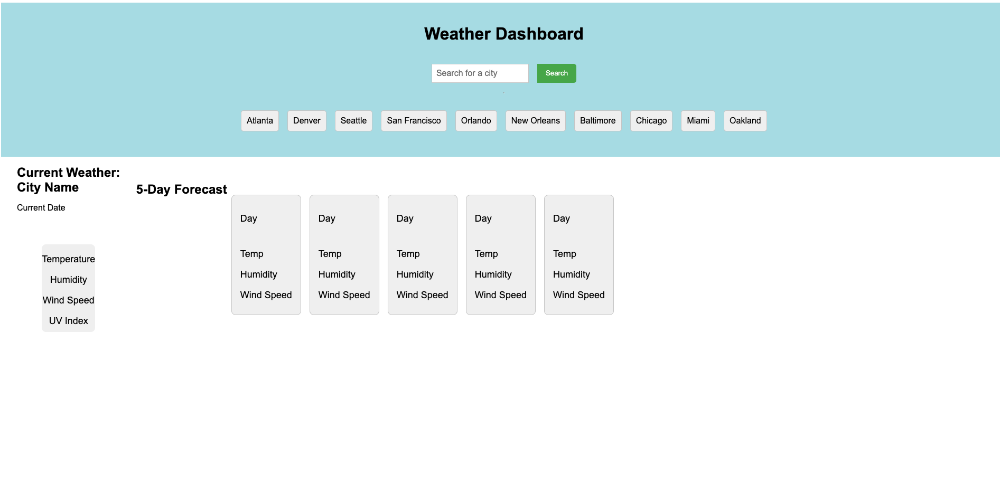

# Server-Side-Dashboard

## Description

I built a weather dashboard to practice my new coding knowledge and have a tool for my early morning biking needs. Additionally, I wanted to provide real-time weather updates and forecasts to help others through this website. The dashboard solves the problem of needing accurate and up-to-date weather information, which is important for people who work outdoors, plan outdoor activities, or have travel plans. It provides information such as temperature, humidity, wind speed, and precipitation forecasts for the user's location or any other location of interest. By using APIs to access weather data, parsing JSON data, integrating third-party libraries and frameworks, and handling errors and exceptions, I gained valuable coding skills from this project.

## Table of Contents

- [Installation](#installation)
- [Usage](#usage)
- [Credits](#credits)
- [License](#license)

## Installation

Review the code on the GitHub repository. The deployed site can be accessed at [GitHub Pages](https://etapm.github.io/Server-Side-Dashboard/) or by visiting the [GitHub Repository](https://github.com/etapm/Server-Side-Dashboard)

## Usage

The weather dashboard is a helpful tool for checking the weather in different cities. You can use the search bar to find the city you want to check. Once you submit the search, the website will display the current weather conditions and a five-day forecast for that city. The website provides information on the temperature, humidity, wind speed, and UV index. If you search for multiple cities, the website lets you see the weather forecast for each city in a list of recent searches. This list comes in handy if you need to check the weather for a city you previously searched for.

Click the "Search" button and see the current weather conditions and a five-day forecast for that city.

## Credits

N/A

## License

N/A

## Badges

N/A

## Features

N/A

## How to Contribute

N/A

## Tests

N/A
